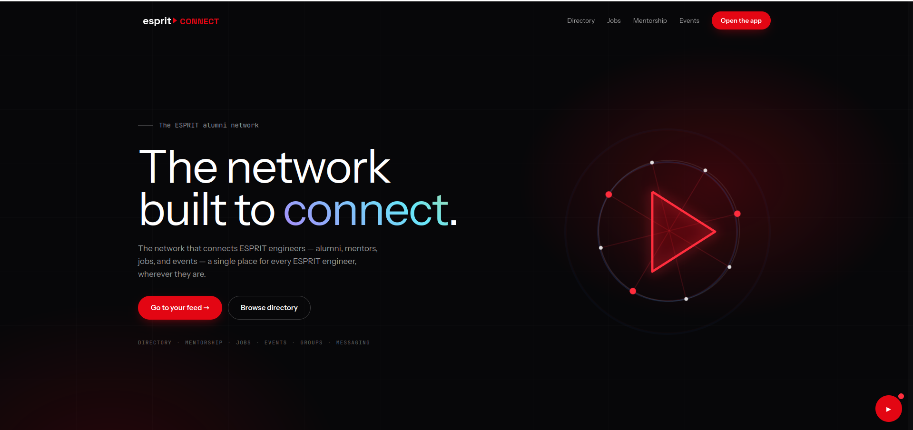

# EspritConnect

## Description
EspritConnect is a full‑stack alumni & student networking platform for **ESPRIT**
(École Supérieure Privée d'Ingénierie et de Technologies, Tunisia). It brings the
school's community into one place: a social **feed**, a searchable **alumni directory**
(with a live map), **profiles** with identity verification, **messaging**, **connections**,
**mentorship**, a **jobs** board with AI‑assisted recommendations, **events** with RSVPs,
**groups**, a moderated **resources** library, and a full **admin back‑office**
(users, roles, moderation, verifications, audit, analytics). It also includes an
in‑app **AI assistant** and AI matching, powered by a local LLM so nothing leaves the stack.

The whole system runs with a single `docker compose up --build` — no manual service
setup required.



## Technologies utilisées
- **Frontend** — Angular 18 (standalone components, signals), TypeScript 5, Tailwind CSS, RxJS, Leaflet (maps), nginx (serving + API proxy)
- **Backend** — Java 21, Spring Boot 3.3, Spring Security 6 + JWT, Spring Data JPA / Hibernate, Flyway, MapStruct, Lombok, SpringDoc OpenAPI (Swagger)
- **AI / verification service** — Python 3.11, FastAPI, dlib + face_recognition (CPU), Tesseract OCR
- **AI assistant / matching** — Ollama running a small local model (`qwen2.5:0.5b`), pulled automatically at startup
- **Base de données / stockage** — PostgreSQL 16, MinIO (S3‑compatible object storage)
- **DevOps** — Docker + Docker Compose

## Prérequis
- **Docker** + **Docker Compose** (the only requirement to run the whole stack)
- ~4 GB free RAM and internet access on first build (to pull images + the LLM)
- Optional, for running services without Docker: Java 21 + Maven, Node.js 20+, Python 3.11

## Installation & lancement
```bash
# from the repo root
cp .env.example .env          # optional: defaults already work for local dev
docker compose up --build
```

> ⏱️ **First run:** roughly **2–4 minutes** to pull base images + install
> dependencies, then the LLM model (~400 MB) is pulled on first start. dlib ships
> as a prebuilt wheel, so there is **no source compilation**. Subsequent runs are
> near‑instant (cached). To bring up only the core stack:
> `docker compose up postgres minio ollama backend frontend`.

Once the stack is up:

| Service | URL |
|---|---|
| **App (frontend)** | http://localhost:4200 |
| API (direct) | http://localhost:8081/api/v1 |
| Swagger UI | http://localhost:8081/swagger-ui.html |
| Health | http://localhost:8081/actuator/health |
| Verification service | http://localhost:8000/health |
| MinIO console (dev) | http://localhost:9001 — `minioadmin` / `minioadmin` |

The database schema and **rich demo data** are created automatically by Flyway on
first boot — the app is populated immediately (users, posts, jobs, events, groups, resources).

### Comptes de démonstration
All seeded accounts use the password **`Test@1234`**:

| Role | Email |
|---|---|
| Admin | `admin@esprit.tn` |
| Alumni | `rania.khelifi@espritconnect.tn` |
| Mentor | `amine.toumi@espritconnect.tn` |
| Recruiter | `david.lemoine@vincit.ai` |
| Student | `sami.bouaziz@espritconnect.tn` |

To promote any account to an active admin manually:
```bash
docker exec espritconnect-db psql -U espritconnect -d espritconnect -c \
"UPDATE users SET role='ADMIN', status='ACTIVE', email_verified=TRUE, identity_verified=TRUE, \
 verified_at=now(), updated_at=now() WHERE lower(email)='put-email-here';"
```

## Variables d'environnement
See **[.env.example](.env.example)** for the full list (MinIO, SMTP, Ollama, CORS, etc.).
Copy it to `.env` and override the values marked *CHANGE IN PROD*. Real secrets must
never be committed — `.env` is gitignored.

## IA — notes (modèles & reproductibilité)
- **No trained model files are committed.** The assistant/matching model
  (`qwen2.5:0.5b`, ~400 MB) is **pulled automatically** by the `ollama-pull` service at
  startup. Change it via `OLLAMA_MODEL` in `.env`.
- **No GPU/CUDA required** — everything runs CPU‑only (Ollama + dlib). Python 3.11.
- **No datasets** are stored in the repo; the verification service uses dlib's built‑in
  face‑encoding model + Tesseract OCR (installed in its Docker image).
- **AI acceptance:** an external user can run the full AI stack locally with
  `docker compose up --build`.

## Lancer sans Docker (optionnel)
```bash
# Backend (Java 21 + Maven) — needs a running Postgres + MinIO
cd backend && mvn spring-boot:run

# Frontend (Node 20+)
cd frontend && npm install && npm start
```

## Structure du projet
```
EspritConnect/
├── docker-compose.yml          # one-command orchestration
├── .env.example                # environment template
├── backend/                    # Spring Boot API (tn.esprit.connect.modules.*)
│   └── src/main/resources/db/migration   # Flyway schema + seed data
├── frontend/                   # Angular 18 app (nginx-served, proxies /api)
├── verification-service/       # FastAPI: OCR + face match
├── docs/                       # technical docs (deployment, DB encryption, …)
└── demo/                       # screenshots + demo video
```

## Documentation


- **Architecture** (diagram + components) : **[docs/ARCHITECTURE.md](docs/ARCHITECTURE.md)**
- **API** : interactive Swagger UI at http://localhost:8081/swagger-ui.html
- Deployment / exposure guide : [docs/EXPOSE.md](docs/EXPOSE.md)
- Database encryption notes : [docs/DATABASE_ENCRYPTION.md](docs/DATABASE_ENCRYPTION.md)

## Démo
- Captures d'écran & vidéo : voir **[demo/](demo/)**
- Vidéo : _à ajouter_
- Déploiement (optionnel) : _à ajouter_

## Auteurs
<table>
  <tr>
    <td align="center" width="160">
      <a href="https://github.com/YonK0">
        <br/>
        <sub><b>Omar Kthiri</b></sub>
      </a>
    </td>
    <td align="center" width="160">
      <a href="https://github.com/Abdallah54">
        <br/>
        <sub><b>Abdallah Naifer</b></sub>
      </a>
    </td>
    <td align="center" width="160">
      <a href="https://github.com/MOETEZ-USERNAME">
        <br/>
        <sub><b>Mohamed Moetez Marouani</b></sub>
      </a>
    </td>
    <td align="center" width="160">
      <a href="https://github.com/wejden97">
        <br/>
        <sub><b>Wejden Ghabarou</b></sub>
      </a>
    </td>
    <td align="center" width="160">
      <a href="https://github.com/amal-dridi">
        <br/>
        <sub><b>Amal Dridi</b></sub>
      </a>
    </td>
  </tr>
</table>
