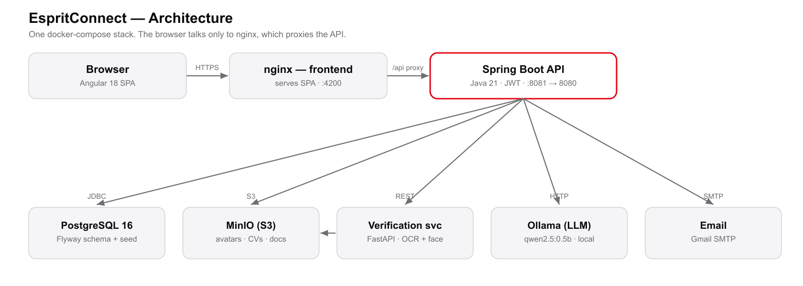
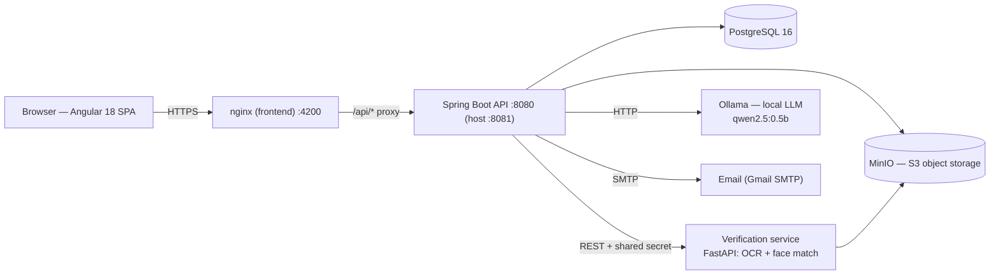

# Architecture — EspritConnect

## Overview
EspritConnect is a containerized, service-oriented web app. Everything is wired
together by `docker-compose.yml`; the browser only ever talks to the frontend
(nginx), which proxies API calls to the backend.

_(Diagram source below as Mermaid — edit it and regenerate the PNG with
`bash scripts/gen-architecture-png.sh`.)_

## Components
| Service (container) | Tech | Role |
|---|---|---|
| `frontend` (espritconnect-web) | Angular 18 + Tailwind, served by nginx | SPA UI; proxies `/api` → backend |
| `backend` (espritconnect-api) | Java 21, Spring Boot 3.3, JWT | REST API, business logic, auth, moderation |
| `postgres` (espritconnect-db) | PostgreSQL 16 | Relational data; schema + seed via Flyway |
| `minio` (espritconnect-minio) | MinIO (S3) | Files: avatars, CVs, post media, ID docs |
| `verification-service` | Python 3.11, FastAPI, dlib, Tesseract | ID OCR + face matching for identity verification |
| `ollama` (+ `ollama-pull`) | Ollama | Local LLM for the assistant + AI matching |

## Data & persistence
- **Schema + demo data**: Flyway migrations in
  `backend/src/main/resources/db/migration` (`V1…V113`) — run automatically on
  first boot. No manual SQL import needed.
- **Object storage**: MinIO bucket(s); the `verification` bucket supports
  optional SSE-S3 encryption at rest.
- **Auth**: stateless JWT (access + refresh) in the browser's localStorage.

## AI in the system
- **Assistant + matching**: a *pretrained* LLM (`qwen2.5:0.5b`) run locally via
  Ollama, pulled at startup (not committed).
- **Identity verification**: dlib's *pretrained* face encoder + Tesseract OCR.
- No model is trained in this project, so there is no training dataset, no
  model-download link, and no train/validation metrics — everything is inference
  on pretrained models, fully reproducible with `docker compose up --build`.

## Request flow (example: login)
1. SPA `POST /api/v1/auth/login` → nginx → backend.
2. Backend authenticates, returns JWT access + refresh tokens.
3. SPA stores tokens; subsequent calls send `Authorization: Bearer …`.
4. The error interceptor silently refreshes the access token on expiry.
